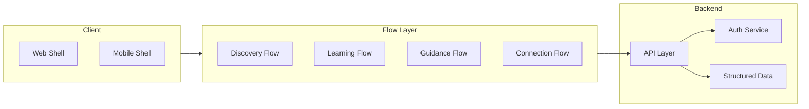

# Khanqah Mujaddidiyya – Product & Development Plan

This plan translates the Initiation Document into a concrete architecture, screen hierarchy, content blocks, and phased roadmap. No code or UI visuals are specified; focus is on flows, structures, data, and behavior. The tone is calm, respectful, and human-focused. It is structured so the next stage—Vibe Coding—can proceed step by step with clear ownership and scope.

---

## 0. AI Agent Roles & Responsibilities

Each area of the plan maps to a guardian role. No single agent overrides the core philosophy; collaboration respects hierarchy and responsibility.

| Role                    | Responsibility                              | Plan Sections                                                      |
| ----------------------- | ------------------------------------------- | ------------------------------------------------------------------ |
| **Vision Keeper**       | Philosophy, feature approval, phase gates   | Core philosophy, success criteria, phase scope                     |
| **Flow Designer**       | Flows, screens, navigation                  | Section 3 (flows), Section 4 (screen hierarchy)                    |
| **Knowledge Curator**   | Learning paths, sessions, content structure | Section 8 (paths, sessions), Section 4.3 (Learning content blocks) |
| **Mentorship Guardian** | Guidance and Bayat flows, sensitive content | Section 3.3 (Guidance flow), Phase 4, Section 8 (request entities) |
| **Tech Architect**      | Architecture, data, incremental structure   | Section 1–2, Section 8 (data models)                               |
| **Amanah Checker**      | Stability, clarity, philosophy adherence    | Success criteria, phase deliverables, validation steps             |
| **User Whisperer**      | Respectful copy and interaction patterns    | Content block intent, CTAs, messaging guidelines                   |

---

## 1. Architecture Overview

- **Single codebase**: One React-based app that is responsive for web and mobile (no separate native app in early phases).
- **Flow-first**: Navigation and UX are driven by the four flows (Discovery, Learning, Guidance, Connection), not by a traditional “page list.”
- **Backend**: Separate service for auth, structured data (learning paths, sessions, enrollments), and APIs; designed so Phase 2+ can plug in without refactors.

---

## 2. Technical Direction (High-Level)

| Concern      | Direction                                                                                                                                         |
| ------------ | ------------------------------------------------------------------------------------------------------------------------------------------------- |
| **Frontend** | Modern React-based framework (e.g. Next.js or Vite + React) with SSR or static export as needed; mobile-first responsive layout.                  |
| **Styling**  | Utility-first CSS (e.g. Tailwind) for calm, consistent, minimal UI and easy theming (soft colors, ample whitespace, readable typography).         |
| **Backend**  | Service that supports REST or minimal API, auth (Phase 2), structured storage for paths/sessions/users, and room to add guidance workflows later. |
| **Data**     | Learning paths and sessions as structured data (e.g. JSON or CMS-backed); no DB required for Phase 1 static content.                              |
| **State**    | Minimal client state; flow-specific state where needed (e.g. “current path,” “current session”); no global over-engineering.                      |

Incremental rule: each phase should be implementable without large rewrites; backend and client boundaries stay clear from the start.

---

## 3. Flow Design (Behavior Only)

### 3.1 Discovery Flow

- **Entry**: First visit lands in a calm welcome (single screen or short sequence).
- **Content**: Purpose explained briefly; learning paths visible (list or cards).
- **Behavior**: No modal signup, no popups, no forced login. Optional “Explore” or “See paths” as primary CTA.
- **Exit**: User can move to Learning Flow (pick a path) or Connection Flow (contact), or leave.

### 3.2 Learning Flow

- **Structure**: Learning Path → Levels (beginner only at first) → Sessions.
- **Data**: Each path has a short intro (human-written); each session is the atomic unit (reading, audio, practice, or announcement).
- **Behavior**: Linear, guided progression; one session at a time; no timers, streaks, or gamification. “Next” / “Back” and clear “You are here” context.
- **Phase 1**: Paths and sessions are static (no enrollment, no progress). Phase 2 adds enrollment and light progress (e.g. “Resume” or “Completed” markers).

### 3.3 Guidance Flow

- **Trigger**: User-initiated only; no auto-prompts.
- **Behavior**: Explanation first (what guidance is, what happens next), then optional request; requests go to “review” (no instant automation). No chat, no AI in scope.
- **Phase**: Fully implemented in Phase 4; Phase 1 can reserve a calm entry point (e.g. “Guidance” in nav) with a short explanation and “Coming later” or disabled CTA.

### 3.4 Connection Flow

- **Actions**: One-tap WhatsApp, one-tap phone, visible email. No complex forms.
- **Placement**: Accessible from nav and/or footer; same on mobile and web.

---

## 4. Screen Hierarchy & Content Blocks (Logical Only)

Screen hierarchy and content blocks are described as logical flows for web and mobile. No UI code or visual specs; this defines what appears where and in what order.

### 4.1 Global Shell (All Flows)

- **Persistent navigation**: Primary nav items—Discover, Learning (or Paths), Guidance, Contact—visible on web and mobile (e.g. top bar or bottom bar on mobile). Same hierarchy on both.
- **Footer (optional)**: Contact links and/or short reassurance line (e.g. “A space for guided learning”). No clutter.
- **No global banners or popups**: No cookie walls, signup modals, or promotional overlays in Phase 1.

### 4.2 Discovery Flow – Screens & Content Blocks

| Logical Screen     | Purpose                            | Content Blocks (in order)                                                                                                                                                                                  |
| ------------------ | ---------------------------------- | ---------------------------------------------------------------------------------------------------------------------------------------------------------------------------------------------------------- |
| **Welcome**        | First impression, calm orientation | Short welcome line; one or two sentences on app purpose (guided learning, human-led); single primary CTA (e.g. “Explore learning paths” or “See paths”); optional secondary link to Contact. No long text. |
| **Paths overview** | Visibility of learning paths       | List or card set of learning paths; each item: path title, very short description, link into Learning flow. No “recommended for you” or algorithms.                                                        |

Flow: Welcome → Paths overview. From Paths overview, user goes to Learning flow (one path) or to Contact. Optional login is not required to see paths (Phase 1: no login; Phase 2: optional “Save progress” or “Enroll” from here).

### 4.3 Learning Flow – Screens & Content Blocks

| Logical Screen   | Purpose                             | Content Blocks (in order)                                                                                                                                                                                                                                            |
| ---------------- | ----------------------------------- | -------------------------------------------------------------------------------------------------------------------------------------------------------------------------------------------------------------------------------------------------------------------- |
| **Path landing** | Introduce one path and its sessions | Path title; short human-written introduction; list of levels (e.g. “Beginner”) and under each, session titles or cards. Clear “Start” or “Continue” (Phase 2) for first or next session.                                                                             |
| **Session view** | Single-session learning unit        | Session title; session type (reading / audio / practice / announcement); body content (text, audio player, or instructions); “Back” and “Next” (or “Finish session”) only. No timers, no progress bar pressure (Phase 1). Optional light progress marker in Phase 2. |

Flow: Path landing → Session 1 → Session 2 → … → back to Path landing or Paths overview. Breadcrumb or “You are here” context (e.g. Path name > Session name) without deep nesting.

### 4.4 Guidance Flow – Screens & Content Blocks (Phase 1 Placeholder; Full in Phase 4)

| Logical Screen              | Purpose                            | Content Blocks (in order)                                                                                                                                                                                                                                                                    |
| --------------------------- | ---------------------------------- | -------------------------------------------------------------------------------------------------------------------------------------------------------------------------------------------------------------------------------------------------------------------------------------------- |
| **Guidance intro**          | Explain guidance, set expectations | Short explanation: what guidance is, that it is human-reviewed, and that there is no automation. Phase 1: “Guidance and Bayat requests will be available in a later phase” and optional link to Contact. Phase 4: add “Request guidance” and “Bayat request” with explanation-before-action. |
| **Request forms (Phase 4)** | User-initiated requests            | Explanation again before any form; simple form fields; clear “Submit for review”; confirmation that a human will respond (no instant automation).                                                                                                                                            |

Flow: Guidance intro → (Phase 4) request form → confirmation message. No chat, no real-time UI.

### 4.5 Connection Flow – Screens & Content Blocks

| Logical Screen | Purpose                      | Content Blocks (in order)                                                                                                                                                          |
| -------------- | ---------------------------- | ---------------------------------------------------------------------------------------------------------------------------------------------------------------------------------- |
| **Contact**    | Direct, low-friction contact | Short reassuring line (e.g. “Reach out when you are ready”); one-tap WhatsApp link; one-tap phone link; visible email address. No contact form in Phase 1. Same on web and mobile. |

Flow: Single screen. Accessible from nav and optionally from footer or Guidance intro.

### 4.6 Navigation Summary (Web + Mobile)

- **Discover**: Welcome → Paths overview.
- **Learning**: Path landing ↔ Session view(s); entry from Discover or (Phase 2) “My paths.”
- **Guidance**: Guidance intro only (Phase 1); intro + request flows (Phase 4).
- **Contact**: Single Contact screen.

No nested menus beyond one level; no dashboards or feeds in Phase 1.

---

## 5. Phase 1 – Foundation (Initial Build)

Scope limited to stability and structure.

**In scope**

- **App shell**: Single codebase; responsive layout that works on web and mobile (breakpoints, touch-friendly targets).
- **Navigation**: Simple, persistent nav (e.g. Discover / Learning / Guidance / Contact) aligned to flows; no deep nesting.
- **Learning paths**: Static data (e.g. JSON or markdown); structure = path → intro → levels → sessions; session types: reading, audio, practice, announcement.
- **Session-based learning UI**: One path view (intro + list of sessions or levels), one session view (content + next/back).
- **UI**: Calm palette, clear typography, minimal decoration, no autoplay or flashing elements.
- **Connection**: Contact screen or section with WhatsApp link, tel link, and email.

**Out of scope (explicitly)**

- Payments, notifications, chat, community, video hosting, AI, login, enrollment, progress tracking.

**Deliverables**

- Repo structure (app, static data, config).
- Implemented Discovery + Learning + Connection flows for static content.
- Guidance flow: placeholder only (explanation + “available in a later phase” or similar).
- One or two sample learning paths with a few sessions each to validate the model.

---

## 6. Phase 2 – Identity & Commitment

**Additions**

- User authentication (register/login) with backend; session handling.
- Enrollment: user can “enroll” in a path; enrollment state stored per user.
- Saved/registered view of learning paths (e.g. “My paths” or “Continue”).
- Light progress: e.g. “last session visited” or “sessions completed” per path; no streaks/rewards.

**Still excluded**

- Gamification, streaks, rewards, pressure-based engagement.

---

## 7. Phases 3–5 (Summary)

- **Phase 3**: Live session announcements, asynchronous question submission, admin responses; no public discussions.
- **Phase 4**: Guidance request system, bayat request workflow, admin review and response; all human-reviewed.
- **Phase 5**: Optional donations, events, extended paths, moderated community; only if needed.

No detailed breakdown here; each will be planned when Phase 2 is stable.

---

## 8. Conceptual Data Models & Relationships

Data is described conceptually (entities and relationships). No schema syntax; this defines what the system remembers and how it connects.

### 8.1 Core Entities

- **User** (Phase 2+): Identity for registered students. Attributes: identifier, auth linkage, optional profile (e.g. display name). Used for enrollment, progress, and (Phase 4) guidance/Bayat requests. No social graph, no public profile in early phases.
- **Learning Path**: A guided learning journey. Attributes: identifier, title, short human-written introduction, ordered levels (e.g. beginner). Owns sessions. Phase 1: static (e.g. JSON/files); Phase 2+: can be referenced by enrollments.
- **Level**: A stage within a path (e.g. “Beginner”). Attributes: identifier, title, order within path. Contains ordered sessions. Beginner-only in Phase 1.
- **Session**: Smallest learning unit. Attributes: identifier, title, type (reading | audio | practice | announcement), body content or reference (text, audio URL, instructions), order within level. Belongs to one level.
- **Enrollment** (Phase 2+): A user’s commitment to a path. Attributes: user, path, optional “last visited session,” optional “sessions completed” or similar light progress. One enrollment per user per path.
- **Guidance Request** (Phase 4): User-initiated request for guidance. Attributes: user, submitted at, status (e.g. submitted | under review | responded), optional response reference. Human-reviewed; no automation.
- **Bayat Request** (Phase 4): Specialized spiritual commitment request. Attributes: user, submitted at, status, optional response reference. Human-reviewed; handled with care and clarity.

### 8.2 Relationships

- **Path** → has many **Levels** (ordered).
- **Level** → has many **Sessions** (ordered).
- **User** (Phase 2+) → has many **Enrollments**; each Enrollment → one **Path**.
- **User** (Phase 4) → can have **Guidance Requests** and **Bayat Requests**; each request → one **User**, reviewed by Admin/Guide (future).

No public comments, likes, or social links in the model. Sessions and paths are content; users and enrollments are identity and commitment; requests are sensitive and human-reviewed.

### 8.3 Phase Mapping

- **Phase 1**: Path, Level, Session only (static). No User, Enrollment, or Request storage.
- **Phase 2**: Add User, Enrollment; persist “last session” and light progress per enrollment.
- **Phase 3**: Add structures for announcements and Q&A (e.g. question entity, admin response); no public discussion.
- **Phase 4**: Add Guidance Request, Bayat Request; link to User and review workflow.
- **Phase 5**: Optional extensions (e.g. donations, events); model TBD when scope is agreed.

---

## 9. Development Methodology (Vibe Coding Rules)

- **One feature at a time**: e.g. shell, then nav, then one flow, then next flow.
- **One responsibility per component**: Small, named components; no “god” components.
- **No large multi-purpose files**: Split by flow or by domain (e.g. discovery, learning, connection).
- **Stability after each phase**: Manual check that core flows work on web and mobile before moving on.
- **No premature optimization**: No performance or scale over-engineering in Phase 1.
- **AI as senior partner**: Use AI for structure, clarity, and incremental tasks; avoid feature creep or unsolicited “improvements.”

---

## 10. Success Criteria (Checklist)

- First-time user feels **calm and oriented** (Discovery).
- Student feels **guided, not overwhelmed** (Learning).
- System stays **stable and understandable** (simple architecture, clear flows).
- Features **grow intentionally** (phase gates, no unplanned scope).

---

## 11. Phase-Wise Implementation Plan (Ready for Vibe Coding)

Structured, step-by-step order for implementation. One feature at a time; stability checks after each phase. No code generation until explicitly requested.

### Phase 1 – Foundation (Step Order)

1. **Setup**: Single codebase (React-based framework), utility CSS (e.g. Tailwind), static data folder. No backend in Phase 1.
2. **App shell**: Responsive layout (web + mobile breakpoints), persistent nav (Discover, Learning, Guidance, Contact), optional footer. Touch-friendly targets on mobile.
3. **Discovery flow**: Welcome screen (content blocks per Section 4.2) → Paths overview (list/cards from static data). No modals, no forced actions.
4. **Learning flow**: Path landing screen (intro + sessions list per Section 4.3) → Session view (content + Back/Next). Static path/session data (one or two sample paths, few sessions each). Session types: reading, audio, practice, announcement.
5. **Connection flow**: Contact screen (WhatsApp, phone, email links). Accessible from nav and optionally footer.
6. **Guidance placeholder**: Guidance intro screen (explanation + “available in a later phase” or similar). No forms.
7. **Calm UI pass**: Typography, spacing, soft palette; no autoplay, no flashing. Validate on desktop and mobile.

**Phase 1 gate**: First-time user can land → see purpose → browse paths → open a path → read sessions → contact, without friction. Guidance intro is visible but inactive.

### Phase 2 – Identity & Commitment (Step Order)

1. **Backend**: Auth service, user storage, API for login/register and session handling.
2. **Enrollment**: Data model and API for “enroll in path”; link user to path. “My paths” or “Continue” entry in Learning flow.
3. **Light progress**: Store “last session visited” and/or “sessions completed” per enrollment; show “Resume” or “Continue” on path landing. No streaks or rewards.
4. **UI**: Optional login/signup from Discovery or path; “Enroll” and “Save progress” where appropriate. No pressure.

**Phase 2 gate**: Registered student can enroll, resume, and see light progress; guest can still explore without login.

### Phases 3–5 (High-Level Order Only)

- **Phase 3**: Announcements surface; Q&A submission and admin response; no public discussion.
- **Phase 4**: Guidance and Bayat request flows; forms with explanation-before-action; human review and response; no automation.
- **Phase 5**: Only if needed; donations, events, extended paths, moderated community; each scoped and approved by Vision Keeper.

---

## 12. Recommended Next Steps

1. **Choose stack**: React framework (e.g. Next.js or Vite), utility CSS (e.g. Tailwind), and backend option (Phase 2) and document in a short ADR or README.
2. **Define data shapes**: Path, Level, Session (per Section 8); one sample path with 2–3 sessions as static JSON or equivalent.
3. **Implement Phase 1** using the step order in Section 11. One feature at a time; one responsibility per component; stability check at the phase gate.
4. **Validate**: Amanah Checker—walk through Discovery → Learning → Connection on desktop and mobile; confirm calm, clear, philosophy-adherent experience.

No code or file edits are specified in this plan; it remains architecture, flows, structures, and behavior only. The plan is ready for the next stage of Vibe Coding when the team decides to begin implementation.